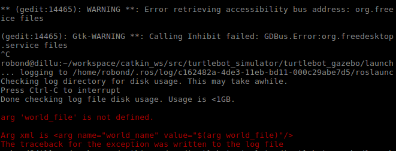
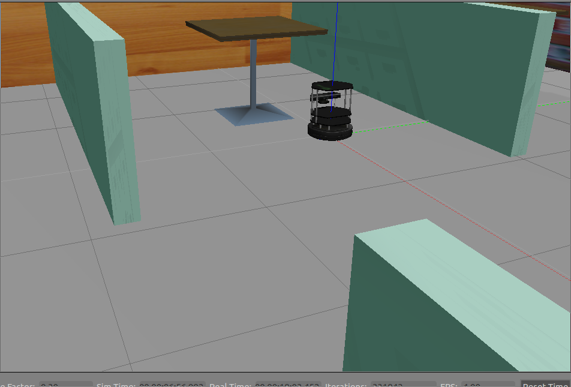
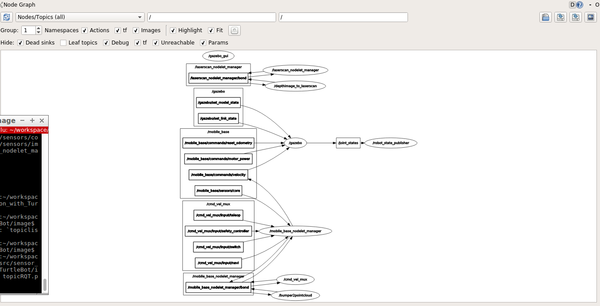
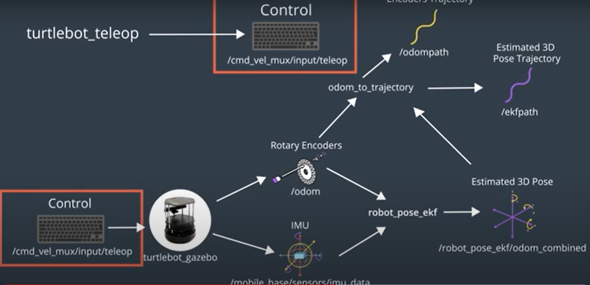

# sensor_fusion_with_TurtleBot
## Turltlebot Repo:
    Clone the package from below link
   [turtlebot package here](https://github.com/turtlebot/turtlebot_simulator)
   
    Once the package is cloned into the workspace install the dependencies for the package by running following command
  `rosdep -i install turtlebot_gazebo` 
  
    After installing all the dependencies we are ready to lauch turtlebot_gazebo world. So run the command
  `roslaunch turtlebot_gazebo turtlebot_world.launch` 
  
  ### You may see some error like this 

  
  
   So the error itself clearly says that the enviroment variable for 'TURTLEBOT_GAZEBO_WORLD_FILE' is not set
    
    To fix this error we need to provide the path to the variable. We can do this by either 
    adding the below command in setup.bash file or can set the variable for current terminal session
    basically we can set any world path ( if you have any other world file feel free to give its path, as of
    now I am setting it to default)
*default path*   `export TURTLEBOT_GAZEBO_WORLD_FILE=/opt/ros/kinetic/share/turtlebot_gazebo/worlds/playground.world`

*coustom*   `export TURTLEBOT_GAZEBO_WORLD_FILE=home/workspace/MyWorldProject/world/RoboRestaurant__.world`
 
    once the enviroment variable is set we launch the turtlebot_world by running the command
   `roslaunch turtlebot_gazebo turtlebot_world.launch`
   
   ### turtlebot world
   
   
    we can check all the topics which the robot is publishing and subscribing by two method, 
	run any of the command given below	
  * `rostopic list` command
	
  * `rqt_graph` command
	
   
# *robot_pose_ekf* Package
[check readme file](robot_pose_ekf/README.md)

# *odom_to_trajectory* Package

this package will produce robot two trajectory after accumulating 1000 samples from below sources
* one based odom data
* other with ekf_output data

[check odom_to_trajectory_package](odom_to_trajectory/README.md)

## *turtlebot* package 

[this package will be used to issue command to the robot ( teleop) ](https://github.com/dil2743/sensor_fusion_with_TurtleBot/tree/main/turtlebot)

